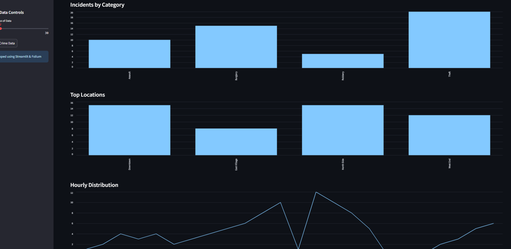
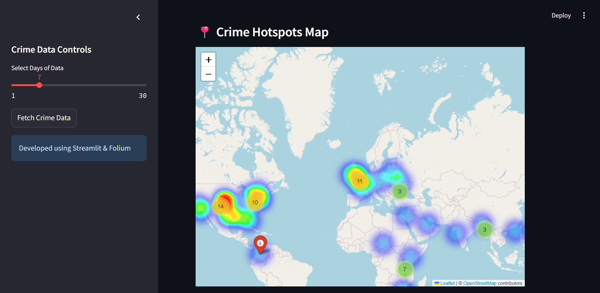
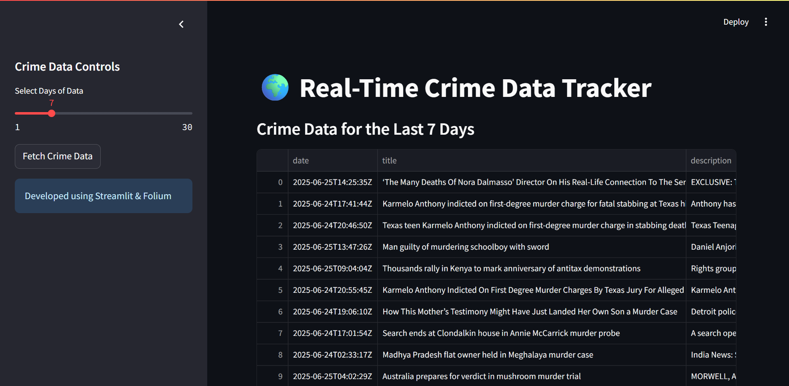

### 🖼️ Screenshots

#### 📊 crime analysis


#### 🔍 geo hotspot location


#### 🧠 crime data fetcher



# Advanced Crime Prediction and Intervention System

A sophisticated crime analysis platform that goes beyond simple historical pattern analysis to incorporate dynamic contextual factors in real-time, creating a truly adaptive and forward-looking crime prevention system with actionable recommendations.

## Features

- **Real-time Crime Data Extraction**: Collects and processes global crime data from news sources
- **Predictive Analytics with Transfer Learning**: Applies patterns from similar cities and regions
- **Risk Amplifier Identification**: Identifies factors that increase crime probability
- **Intervention Recommendation Engine**: Generates targeted, evidence-based prevention strategies
- **Feedback Loop Validation**: Tracks intervention effectiveness and automatically refines prediction models

## Key Components

1. **Crime Prediction System**
   - Uses transfer learning to apply patterns from similar regions
   - Identifies risk amplifiers (time patterns, locations, environmental factors)
   - Generates future crime hotspot predictions with risk scores

2. **Intervention Recommendation Engine**
   - Creates tailored intervention strategies for each hotspot
   - Recommends specific actions based on crime type and risk level
   - Provides priority ranking for resource allocation

3. **Feedback Loop Validation**
   - Validates prediction accuracy against actual outcomes
   - Measures intervention effectiveness
   - Automatically improves models based on real-world results

## Installation

1. Clone the repository
2. Install required dependencies:
   ```
   pip install -r requirements.txt
   ```
3. Download the spaCy language model:
   ```
   python -m spacy download en_core_web_sm
   ```

## Usage

Run the Streamlit dashboard:
```
streamlit run crime_dashboard.py
```

The dashboard provides several functionalities:
- Fetch and analyze real-time crime data
- Generate predictions and identify risk factors
- View recommended interventions for high-risk areas
- Track intervention effectiveness and validate model performance

## API Keys

This application uses the NewsAPI to fetch real-time crime data. You'll need to:
1. Obtain an API key at [newsapi.org](https://newsapi.org/)
2. Set the key as a Streamlit secret or directly in the code

## Project Structure

- `crime_dashboard.py`: Main Streamlit dashboard application
- `real_time_crime_extractor.py`: Extracts crime data from news sources
- `crime_predictor.py`: Predictive analytics and risk amplification
- `intervention_engine.py`: Generates intervention recommendations
- `feedback_validator.py`: Validates model performance and tracks interventions

## Data Files

The system uses several JSON files for data persistence:
- `crime_data.csv`: Raw crime data extracted from news sources
- `crime_analysis.json`: Basic crime pattern analysis
- `crime_hotspots.json`: Predicted crime hotspots
- `risk_amplifiers.json`: Identified risk factors
- `intervention_recommendations.json`: Generated intervention strategies
- `validation_metrics.json`: Model performance metrics

## Future Enhancements

- Integration with real-time police dispatch systems
- Mobile application for field officers
- Automated intervention deployment tracking
- AI-driven resource optimization 